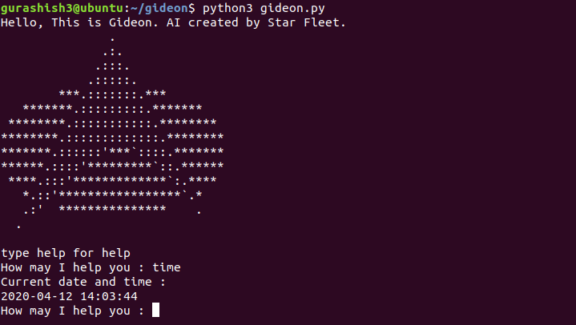

# Gideon

It's an AI assistant application for your linux terminal built using python scripting. 

The aim is to make a terminal application that can manage variety of tasks for the user. Being able to accomplish tasks faster without getting into complex working of linux commands, also makes you look cooler while doing it. 

## Current Features 

- Setup - Automatic setup on first run (recently added) 
- Send Emails- Send emails without getting out of terminal.
- YouTube downloader - Gideon downloads any video that you want from YouTube. You can also download the video as just an audio, and you can     also download whole playlists on youtube both as video or audio.
- Internet Speed Test - Ask gideon to test download, upload and ping of your connected network.
- Geolocation finder- Ask Gideon to locate any ip address. 
- Weather - Ask Gideon to show the current weather of your city.
- Time - Shows the current date and time.
- Directory management - Gideon handles the complexity of directory management for you.
- OS info - Displays the underlying OS info. 
- generate password - Genertaes a strong randomized password of required length.
- Play rock, paper, scissor - play a graphic version of rock, paper and scissor directly in linux terminal. 
- Ascii Art - I have incorporated some ascii art,  to make app look and feel better. 

## Requirements

- You will need to have python 3 installed. If you have not installed that, you can using this command

  ```
  sudo apt-get update
  sudo apt-get install python3.6
  ```

- You can check if python is installed using:

  ```
  python3 --version
  ```

- After this you will also have to install pip python utility in linux. This is because the project uses some external libraries that an be only installed through pip. You can do that using the command below. 

  ```
  sudo apt install python3-pip
  ```

## Installation

- git clone the project repository
- Run the setup.py file. This will atomically install all the external libraries needed (like - `python3 setup.py`).
- Now run the gideon.py (like - `python3 gideon.py`)
- It should look like below. 

	

## Features to Implement

- Currently the directory management is pretty limited. As you can only delete, move and copy directory trees and current files right now. So I am looking to expand on this and add more directory and file management abilities.
- I am also looking to implement some security features, as in running nmap and displaying results in much more readable format. 
- Also I plan on making many quality of life improvements to this project. To make it more convenient to use. 
- Also I will be looking to add a google image downloader feature in future. 

## Support

For any questions contact  me at gurashish1000@gmail.com
